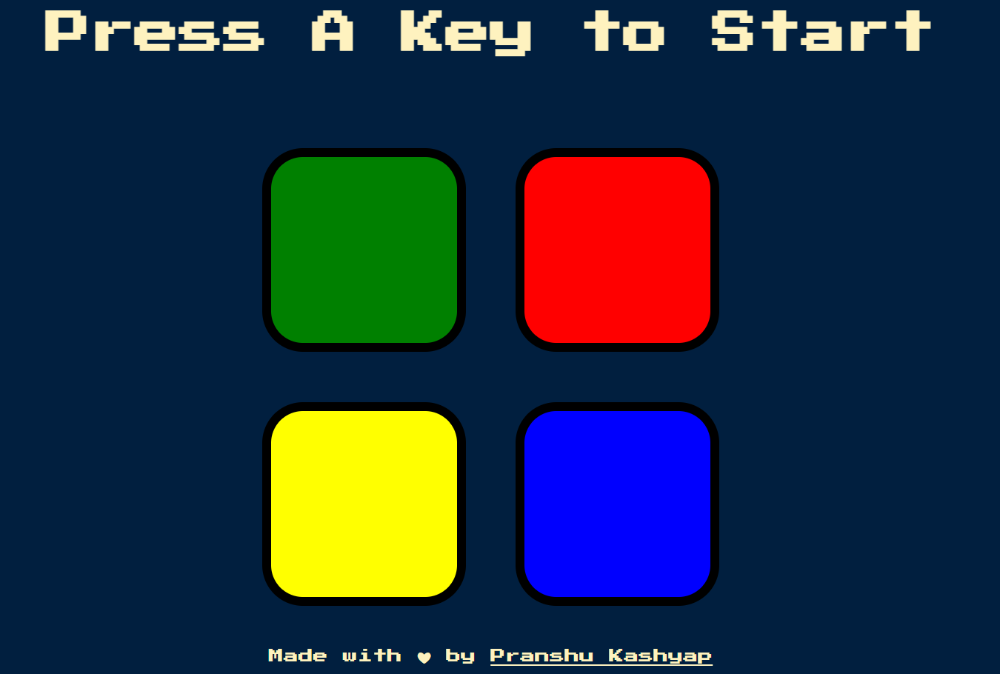

#  🕹 The Simon Game

Get ready to watch, remember, and repeat! The Simon game is the exciting digital game of lights and sounds in which players must repeat random sequences of lights by pressing the colored pads in the correct order. Experience the fun as you repeat the patterns and advance to higher levels. 

Keep track of your score as you challenge friends or try to beat your own high score!

Instruction: You're given 4 Colour Pads. In the beginning press any key to start the game. Randomly one of the Pads will trigger remember the Sequence in which pads triggered and click the Pads in the Same order. 

[History of the Game](https://en.wikipedia.org/wiki/Simon_(game))

[Instruction](https://www.youtube.com/watch?v=1Yqj76Q4jJ4)

## Deployment

Deployment: https://pranshukas.github.io/Simon-Game/

## Built With

  - HTML
  - CSS
  - JavaScript
  - jQuery

## Authors

  - **Pranshu Kashyap**
    ([pranshukas](https://pranshukas.github.io/Simon-Game/))
    
## License

This project is licensed under the MIT License.

Copyright (c) 2021 Pranshu Kashyap

Permission is hereby granted, free of charge, to any person obtaining a copy
of this software and associated documentation files (the "Software"), to deal
in the Software without restriction, including without limitation the rights
to use, copy, modify, merge, publish, distribute, sublicense, and/or sell
copies of the Software, and to permit persons to whom the Software is
furnished to do so, subject to the following conditions:

The above copyright notice and this permission notice shall be included in all
copies or substantial portions of the Software.

THE SOFTWARE IS PROVIDED "AS IS", WITHOUT WARRANTY OF ANY KIND, EXPRESS OR
IMPLIED, INCLUDING BUT NOT LIMITED TO THE WARRANTIES OF MERCHANTABILITY,
FITNESS FOR A PARTICULAR PURPOSE AND NONINFRINGEMENT. IN NO EVENT SHALL THE
AUTHORS OR COPYRIGHT HOLDERS BE LIABLE FOR ANY CLAIM, DAMAGES OR OTHER
LIABILITY, WHETHER IN AN ACTION OF CONTRACT, TORT OR OTHERWISE, ARISING FROM,
OUT OF OR IN CONNECTION WITH THE SOFTWARE OR THE USE OR OTHER DEALINGS IN THE
SOFTWARE.

## Acknowledgments

  * The Complete 2021 Web Development Bootcamp by Angela Yu

